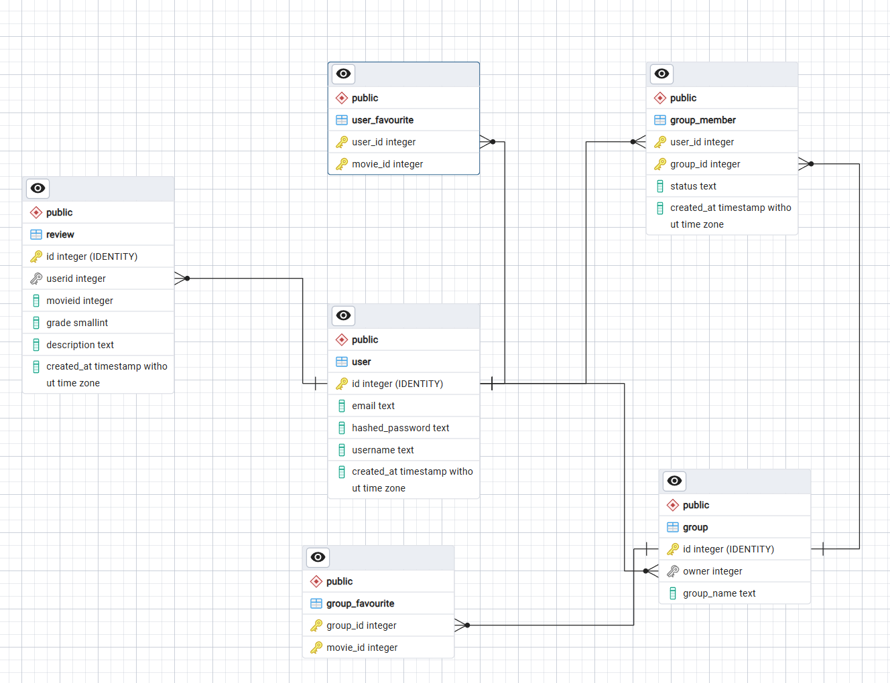

# Group 11 Movie App project

Movie application built with React, Vite, Express and PostgreSQL. Movie data is provided by TMDB. Users can create an account, sign in, create groups, manage their profile and write movie reviews.

## Features

### Available Without Signing In

- Browse the movies currently playing in cinemas.
- Search for movies by title, release year or genre.
- Move between search result pages.
- Open a movie's details, including its poster, title, overview and release date.
- Read reviews, average grades and paginated review results.
- Create a user account or sign in.

### Available After Signing In

- View your profile information.
- Update your username and email address.
- Delete your account and its associated data.
- Sign out of the application.

## Requirements

- Docker Desktop with Docker Compose
- A TMDB API token

## Configuration

Create the local environment file from the example:

```bash
copy env_example .env
```

Update `.env` with your own values. In particular, set:

```env
POSTGRES_USER=yourusername
POSTGRES_PASSWORD=yourpassword
POSTGRES_DB=dbname
POSTGRES_HOST=database
TMDB_TOKEN=your_tmdb_token
JWT_SECRET_KEY=use_a_long_random_secret
VITE_API_URL=http://localhost:3001
```

`POSTGRES_HOST=database` is required when the backend runs through Docker Compose because `database` is the Compose service name. The frontend still reaches the backend through `localhost` from the browser.

## Run With Docker

Start the database, backend and frontend in development mode:

```bash
docker compose up --build
```

Open the frontend at <http://localhost:5173>. The backend is available at <http://localhost:3001>.

To stop the services:

```bash
docker compose down
```

To remove the PostgreSQL data volume as well:

```bash
docker compose down -v
```

When dependencies are added to `server/package.json`, rebuild the backend and renew its anonymous `node_modules` volume:

```bash
docker compose up -d --build --renew-anon-volumes backend
```

## Run Without Docker

Install dependencies in both project directories:

```bash
npm install
cd server
npm install
```

Start the frontend and backend in separate terminals:

```bash
npm run dev
```

```bash
cd server
npm run dev
```

For a locally running PostgreSQL server, set `POSTGRES_HOST=localhost` in `.env` and create the configured database before starting the backend. The SQL files in `server/database` contain the schema and seed data used by Docker.

## Tests and Checks

Frontend linting and production build:

```bash
npm run lint
npm run build
```

Backend tests:

```bash
cd server
npm test
```

## Project Structure

```text
src/                  React frontend and screens
server/controllers/   Backend request handlers
server/routers/       Express API routes
server/models/        Database-related models
server/database/      PostgreSQL schema and seed data
docker-compose.yml    Local development services
```

## Entity Relationship Diagram


